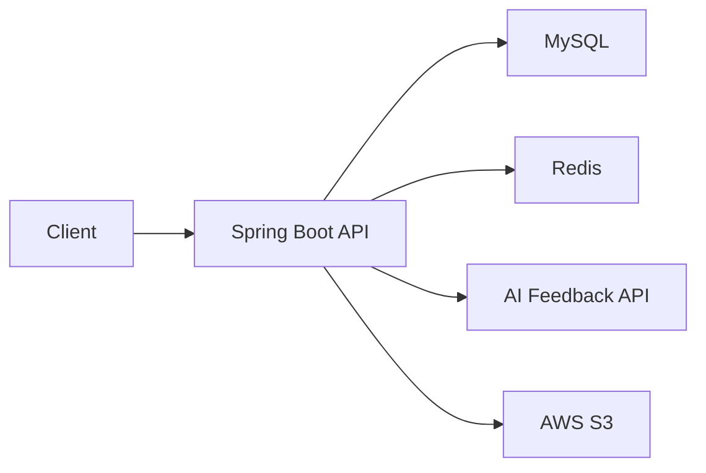

# MyGrowth

MyGrowth는 개인 루틴 관리, 챌린지 참여, 주간 AI 피드백을 제공하는 Spring Boot 기반 백엔드 프로젝트입니다. 사용자는 반복 루틴을 만들고 날짜별 수행 여부를 기록할 수 있으며, 챌린지를 통해 목표 달성을 관리하고 주간 루틴 데이터를 바탕으로 AI 피드백을 받을 수 있습니다.

## 주요 기능

- JWT 기반 회원가입, 로그인, 로그아웃, Access Token 재발급
- Redis TTL 기반 Refresh Token 저장 및 관리
- 사용자 프로필 조회 및 수정
- 반복 주기 기반 루틴 생성, 조회, 수정, 삭제
- 날짜별 루틴 조회 및 루틴 체크인
- 주간, 월간 루틴 성공률 통계 조회
- 챌린지 생성, 조회, 수정, 삭제
- 챌린지 참여 및 챌린지별 개인 루틴 등록
- 챌린지 인증 로그 등록
- 주간 루틴 데이터를 활용한 AI 피드백 조회
- Swagger UI 기반 API 문서 제공

## 기술 스택

| 구분 | 기술 |
| --- | --- |
| Language | Java 17 |
| Framework | Spring Boot 3.5.3, Spring Security, Spring Data JPA |
| Database | MySQL, H2 |
| Cache | Redis, Redisson |
| Authentication | JWT |
| AI | Spring AI, OpenAI-compatible Gemini endpoint |
| API Docs | springdoc-openapi, Swagger UI |
| Build | Gradle |
| Test | JUnit 5, Mockito, AssertJ, Spring Security Test |
| Other | QueryDSL, Lombok, Spring Retry, AWS S3 SDK |

## 시스템 구조



- MySQL은 회원, 루틴, 루틴 로그, 챌린지, 챌린지 로그, 주간 리포트 데이터를 저장합니다.
- Redis는 Refresh Token과 인증 관련 상태를 TTL 기반으로 관리합니다.
- AI 피드백 기능은 주간 루틴 데이터를 기반으로 피드백 응답을 생성합니다.
- S3 연동 의존성이 포함되어 있으며, 이미지 저장 기능 확장에 사용할 수 있습니다.

## 프로젝트 구조

```text
src/main/java/com/example/mygrowth
├── MyGrowthApplication.java
├── domain
│   ├── auth
│   │   ├── controller
│   │   ├── dto
│   │   └── service
│   ├── user
│   ├── routine
│   ├── challenge
│   └── aifeedback
└── global
    ├── common
    ├── config
    ├── constant
    ├── exception
    ├── filter
    └── provider
```

## 시작하기

### 요구사항

- Java 17
- MySQL
- Redis

### 환경 변수

애플리케이션은 `application.properties`에서 `.env` 파일을 선택적으로 불러옵니다. 프로젝트 루트에 `.env` 파일을 만들고 아래 값을 설정합니다.

```env
MYSQL_URL=jdbc:mysql://localhost:3306/mygrowth
MYSQL_USERNAME=your_mysql_username
MYSQL_PASSWORD=your_mysql_password
JPA_HIBERNATE_DDL=update
JWT_SECRET=your_jwt_secret
REDIS_HOST=localhost
OPENAI_KEY=your_openai_or_gemini_compatible_key
GEMINI_KEY=your_gemini_key
```

`JWT_SECRET`은 JWT 서명에 사용되므로 충분히 긴 임의 문자열을 사용하는 것이 좋습니다.

### 실행

```bash
./gradlew bootRun
```

기본 서버 포트는 `8081`입니다.

```text
http://localhost:8081
```

### 테스트

```bash
./gradlew test
```

테스트 실행 시에도 `JWT_SECRET` 등 인증 관련 설정값이 필요할 수 있습니다.

## API 문서

애플리케이션 실행 후 Swagger UI에서 API를 확인할 수 있습니다.

```text
http://localhost:8081/swagger-ui
```

## 주요 API

### Auth

| Method | Endpoint | 설명 |
| --- | --- | --- |
| POST | `/api/auth/signup` | 회원가입 |
| POST | `/api/auth/login` | 로그인 |
| POST | `/api/auth/logout` | 로그아웃 |
| POST | `/api/auth/refresh` | Access Token 재발급 |

### User

| Method | Endpoint | 설명 |
| --- | --- | --- |
| GET | `/api/users/profile` | 내 프로필 조회 |
| PATCH | `/api/users/profile` | 내 프로필 수정 |

### Routine

| Method | Endpoint | 설명 |
| --- | --- | --- |
| POST | `/api/routines` | 루틴 생성 |
| GET | `/api/routines` | 전체 루틴 조회 |
| GET | `/api/routines/by-date` | 날짜 기준 루틴 조회 |
| GET | `/api/routines/{id}` | 루틴 단건 조회 |
| PATCH | `/api/routines/{id}` | 루틴 수정 |
| DELETE | `/api/routines/{id}` | 루틴 삭제 |
| POST | `/api/routines/{routineId}/checkin` | 루틴 체크인 |
| GET | `/api/routines/statistics/success-rate` | 루틴 성공률 통계 조회 |

### Challenge

| Method | Endpoint | 설명 |
| --- | --- | --- |
| POST | `/api/challenges` | 챌린지 생성 |
| GET | `/api/challenges` | 챌린지 목록 조회 |
| GET | `/api/challenges/{id}` | 챌린지 단건 조회 |
| PATCH | `/api/challenges/{id}` | 챌린지 수정 |
| DELETE | `/api/challenges/{id}` | 챌린지 삭제 |
| POST | `/api/challenges/{id}/join` | 챌린지 참여 |
| POST | `/api/challenges/{id}/my-routines` | 챌린지용 개인 루틴 등록 |
| GET | `/api/challenges/{id}/my-routines` | 챌린지용 개인 루틴 조회 |
| POST | `/api/challenges/{id}/log` | 챌린지 인증 로그 등록 |

### AI Feedback

| Method | Endpoint | 설명 |
| --- | --- | --- |
| GET | `/api/ai/weekly-feedback` | 주간 AI 피드백 조회 |

## 인증 방식

로그인에 성공하면 Access Token과 Refresh Token을 발급합니다. Access Token은 API 인증에 사용하며, Refresh Token은 Redis에 TTL과 함께 저장되어 Access Token 재발급에 사용됩니다.

인증이 필요한 API는 아래 형식의 Authorization 헤더를 사용합니다.

```http
Authorization: Bearer <access-token>
```

## 챌린지 동시성 처리

챌린지 참여 기능은 동시에 여러 사용자가 같은 챌린지에 참여할 때 정원 초과와 참여자 수 불일치가 발생하지 않도록 설계되어 있습니다.

- `Challenge` 엔티티의 `@Version`을 활용한 낙관적 락
- `@Retryable` 기반 재시도 처리
- `challenge_participant`의 `(challenge_id, user_id)` 유니크 제약을 통한 중복 참여 방지

애플리케이션 레벨에서는 버전 충돌을 감지하고, 데이터베이스 레벨에서는 참여 데이터의 무결성을 보장합니다.

## 트러블슈팅 기록

### 새로고침 시 로그인 상태가 유지되지 않는 문제

- 원인: Access Token을 메모리에만 저장하면 브라우저 새로고침 시 토큰이 사라질 수 있습니다.
- 원인: 개발 환경에서 Refresh Token 쿠키에 `Secure=true`가 적용되면 HTTP 요청에 쿠키가 포함되지 않을 수 있습니다.
- 해결: 개발 환경과 운영 환경의 쿠키 옵션을 분리하고, Redis TTL 기반 Refresh Token 관리로 재발급 흐름을 보강합니다.

### 챌린지 참여 동시성 문제

- 원인: 동시에 여러 참여 요청이 들어오면 정원 초과 또는 참여자 수 불일치가 발생할 수 있습니다.
- 해결: `@Version` 기반 낙관적 락, 재시도 로직, DB 유니크 제약을 함께 적용합니다.

## 라이선스

현재 별도 라이선스 파일은 포함되어 있지 않습니다.
