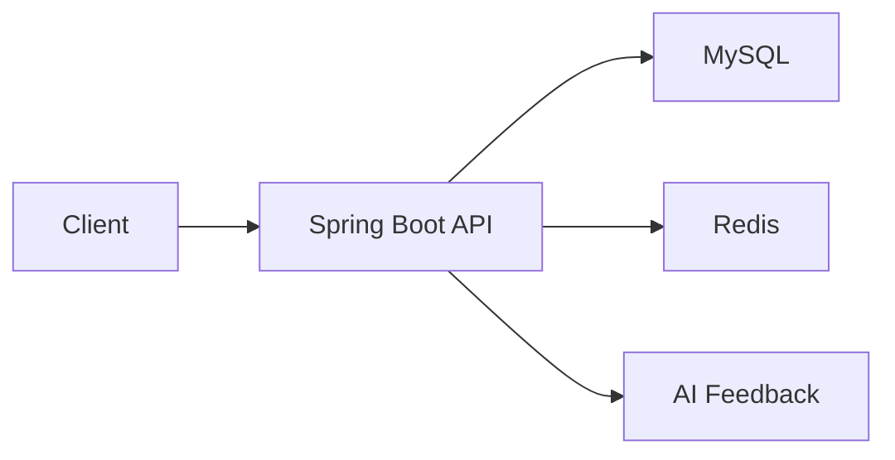

# MyGrowth

MyGrowth는 반복 루틴을 기록하고 달성률을 확인하며, 챌린지 참여와 주간 AI 피드백을 통해 습관 형성을 돕는 Spring Boot 기반 백엔드 프로젝트입니다.

## Overview

- 반복 주기 기반 루틴 생성, 조회, 수정, 삭제
- 날짜별 루틴 체크인 및 주간·월간 달성률 통계
- JWT 기반 회원가입, 로그인, 로그아웃, Access Token 재발급
- Redis TTL 기반 Refresh Token 관리
- 챌린지 생성, 조회, 참여 기능
- 챌린지 참여 시 `@Version` 기반 낙관적 락으로 동시성 제어
- 주간 루틴 데이터를 바탕으로 한 AI 피드백 API

## Tech Stack

- Language: Java 17
- Framework: Spring Boot 3.5.3, Spring Security, Spring Data JPA, Spring Retry
- Database: MySQL, H2
- Cache: Redis
- API Docs: Swagger UI
- Build: Gradle
- Other: QueryDSL, Spring AI, AWS S3

## Architecture



- `MySQL`은 회원, 루틴, 루틴 로그, 챌린지, 주간 리포트 데이터를 저장합니다.
- `Redis`는 Refresh Token TTL 관리에 사용합니다.
- AI 피드백 기능은 주간 루틴 데이터를 바탕으로 응답을 생성합니다.

## Main Features

### 1. Auth

- `POST /api/auth/signup`: 회원가입
- `POST /api/auth/login`: 로그인
- `POST /api/auth/logout`: 로그아웃
- `POST /api/auth/refresh`: Access Token 재발급

로그인 시 Access Token을 발급하고, Refresh Token은 Redis와 쿠키를 함께 사용해 관리합니다.

### 2. Routine

- `POST /api/routines`: 루틴 생성
- `GET /api/routines`: 전체 루틴 조회
- `GET /api/routines/by-date`: 날짜 기준 루틴 조회
- `GET /api/routines/{id}?date=...`: 단건 조회
- `PATCH /api/routines/{id}`: 루틴 수정
- `DELETE /api/routines/{id}`: 루틴 삭제
- `POST /api/routines/{routineId}/checkin`: 루틴 체크인
- `GET /api/routines/statistics/success-rate`: 주간·월간 달성률 조회

반복 타입은 요일 기반, 월간, 연간 패턴을 지원합니다.

### 3. Challenge

- `POST /api/challenges`: 챌린지 생성
- `GET /api/challenges`: 챌린지 목록 조회
- `GET /api/challenges/{id}`: 챌린지 단건 조회
- `PATCH /api/challenges/{id}`: 챌린지 수정
- `DELETE /api/challenges/{id}`: 챌린지 삭제
- `POST /api/challenges/{id}/join`: 챌린지 참여

챌린지 참여 기능은 `Challenge` 엔티티의 `@Version`을 활용한 낙관적 락과 재시도 로직으로 동시 요청 상황을 제어합니다.

### 4. AI Feedback

- `GET /api/ai/weekly-feedback`: 주간 AI 피드백 조회

루틴 수행 데이터를 기반으로 주간 피드백을 생성합니다. 스케줄링 기반 주간 리포트 저장 로직도 포함되어 있습니다.

## Concurrency Handling

챌린지 참여 기능은 동시에 여러 사용자가 같은 챌린지에 참여할 때 정원 초과나 참여자 수 불일치를 방지해야 합니다.

- `Challenge` 엔티티에 `@Version` 적용
- `@Retryable`을 사용해 낙관적 락 충돌 시 재시도
- `challenge_participant`에 `(challenge_id, user_id)` 유니크 제약을 두어 중복 참여 방지

이 구조로 애플리케이션 레벨에서는 충돌을 감지하고, DB 레벨에서는 데이터 무결성을 보장합니다.

## Troubleshooting

### 1. 새로고침 시 로그인 해제 문제

- 현상: 페이지 새로고침 시 로그인 상태가 유지되지 않고 로그인 화면으로 이동
- 원인:
  - Access Token을 메모리에만 저장해 새로고침 시 사라짐
  - Refresh Token 쿠키에 `Secure=true`가 적용되어 HTTP 개발 환경에서 전송되지 않음
- 해결:
  - 개발 환경에서는 쿠키 `Secure` 옵션을 분리 적용
  - Redis TTL 기반 Refresh Token 관리로 재발급 흐름 보강
- 배운 점: 인증 문제는 토큰 저장 위치뿐 아니라 쿠키 정책과 실행 환경까지 함께 고려해야 함

### 2. 챌린지 참여 동시성 문제

- 현상: 동시 요청 시 정원 초과 또는 참여자 수 불일치 가능성 존재
- 해결:
  - `@Version` 기반 낙관적 락 적용
  - 충돌 발생 시 재시도 로직 추가
  - DB 유니크 제약으로 중복 참여 방지
- 배운 점: 동시성 문제는 락 전략과 데이터 무결성 제약을 함께 설계해야 안정적으로 해결 가능

## Project Structure

```text
src/main/java/com/example/mygrowth
├── domain
│   ├── auth
│   ├── user
│   ├── routine
│   ├── challenge
│   └── aifeedback
└── global
    ├── config
    ├── provider
    ├── filter
    └── exception
```

## Getting Started

### 1. Requirements

- Java 17
- MySQL
- Redis

### 2. Environment Variables

`src/main/resources/application.properties` 기준으로 아래 환경 변수가 필요합니다.

```env
MYSQL_URL=jdbc:mysql://localhost:3306/mygrowth
MYSQL_USERNAME=your_username
MYSQL_PASSWORD=your_password
JPA_HIBERNATE_DDL=update
JWT_SECRET=your_jwt_secret
REDIS_HOST=localhost
OPENAI_KEY=your_openai_key
GEMINI_KEY=your_gemini_key
```

### 3. Run

```bash
bash ./gradlew bootRun
```

애플리케이션 기본 포트는 `8081`입니다.

## API Docs

Swagger UI:

- [http://localhost:8081/swagger-ui](http://localhost:8081/swagger-ui)

## Test

```bash
bash ./gradlew test
```

테스트 실행 시 인증 관련 설정값이 필요하므로 `JWT_SECRET` 등의 환경 변수를 함께 설정해야 합니다.
